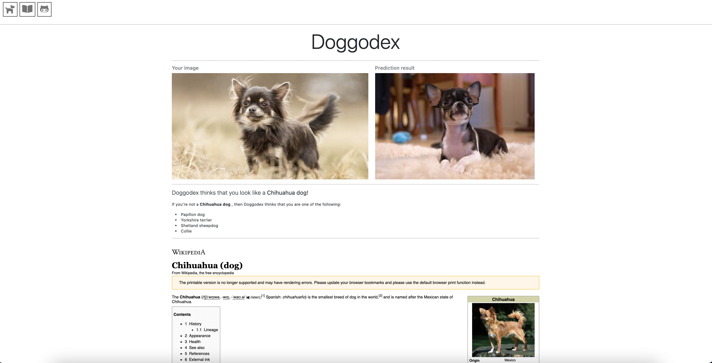

# Doggodex - a dog breed classifier

Doggodex is a web app that tries its best to classify a dog's breed, given an input image.
Doggodex can be found at: http://doggodex.com

## How does Doggodex work?
Doggodex is built on a machine learning model that has been trained using a Convolutional Neural Netowrk (CNN) and a ton of dog pictures as supplied from 'Stanfords dogs dataset'. Tensorflow and Keras were primarily used to train the ML model.
It is almost entirely written in Python (flask, etc.), with a sprinkle of html thrown in there -- prettied up with Bootstrap.

-------

# Setup project:

## Environment setup:

### Setting up with Conda:

If you're on an M1 Macbook or an ARM based machine and you want to be able to run the model (as of early 2021), you will need to set up the environment using conda, otherwise you will not be able to install the packages, run the model & the web app.
You will want to refer to this article here to install Python (arm64) via Miniforge: https://medium.com/codex/installing-tensorflow-on-m1-macs-958767a7a4b3

After that, you will want to activate the conda environment to install the new packages with the .yml file. 
If this is also confusing to you, please refer to conda docs regarding this topic: https://docs.conda.io/projects/conda/en/latest/user-guide/tasks/manage-environments.html#creating-an-environment-from-an-environment-yml-file

Steps: 
- Install arm64 compatible version of Python via Miniforge
- `conda env create -f keras-dog-env.yml`
- `conda activate keras-dog`

### Setting up with pip:

`pip` is much easier to use and can be used if you're on a machine that uses x_86 architecture.

Steps:
- Create a Python virtual environment
- Activate the environment
- Run `pip install -r requirements.txt`

-------

# Running the model:
If you would like to fiddle around and run the model, this section here will document how to get that done.

### Sourcing data:
To start off with, we need some data. 
Doggodex's model is trained using data set from "Stanford dogs dataset" which can be found at: http://vision.stanford.edu/aditya86/ImageNetDogs/

- Download the dataset and place the folder on the same level directory as the '/src/' folder (top-level).
- Re-name the dataset folder into 'dog_pics'. Feel free to re-name it something else, but remember to change the 'filepath' variable as needed.

### Pre-processing data:
You can then pre-process the data by running a script containing the `process_all_images_to_fit()` function.
This should then be followed by splitting the dataset into training and validation sets using `split_dataset()` function.
This is already set-up in the `main.py` file. You can run this in your terminal via: `python3 -B src/main.py`.

### Running the model:
The CNN model can be ran in the terminal by running `python3 -B src/model/conv_net.py`.
Alternatively, if you would like to run it in a .pynb file and want to be able to mess around and visualise the data, you can run the cells inside `notebook.pynb`
